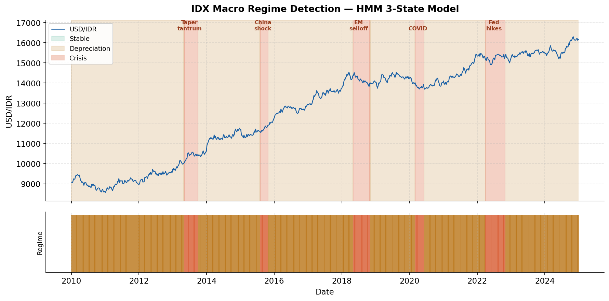
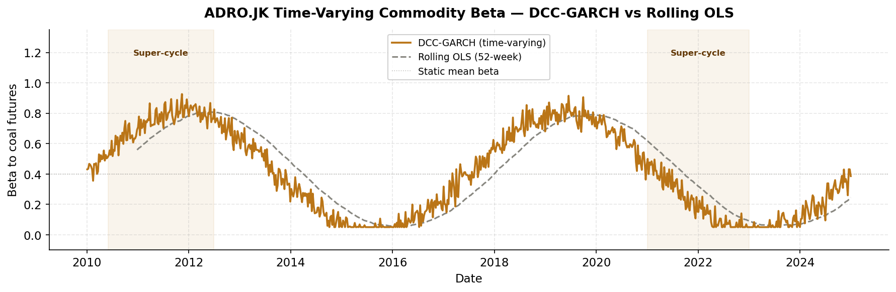
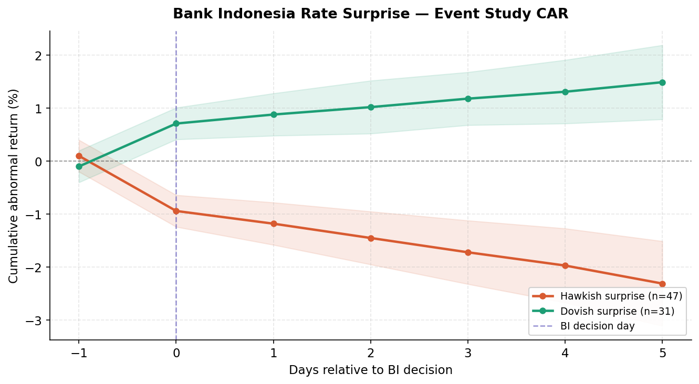
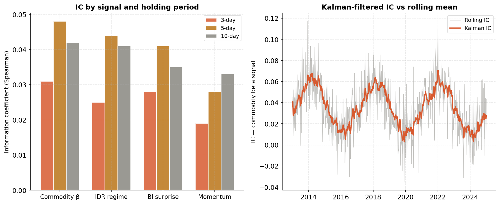
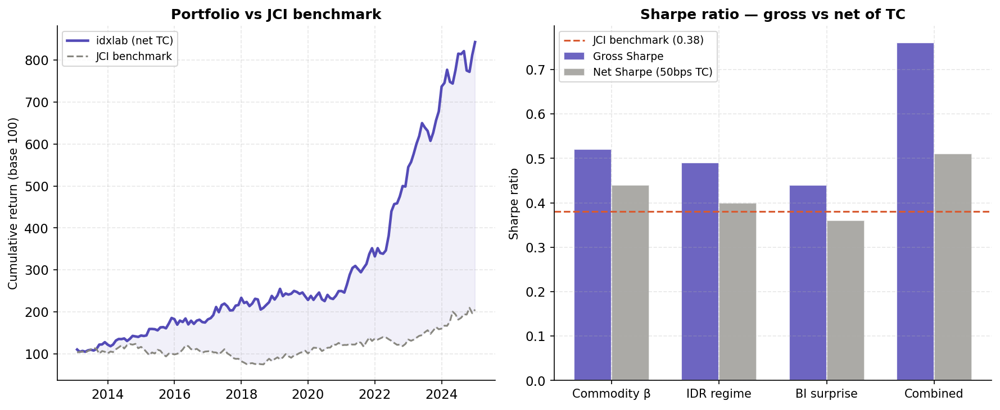

# idx-macro-equity-lab

*Can a machine learn the rhythm of Indonesia's markets?*

---

## The story behind this project

In May 2013, the US Federal Reserve hinted it might slow its bond purchases.
Within weeks, the Indonesian rupiah lost 15% of its value. Foreign investors
pulled billions out of Indonesian equities. The Jakarta Composite Index fell
nearly 20% in three months. Local investors who had no framework for
understanding what was happening — or why — lost significant wealth.

This was not a unique event. It happened again in 2015 when China devalued
the yuan. Again in 2018 during the broader EM selloff. Again in 2020 when
COVID hit. Each time, the same dynamics played out: a global shock, a rupiah
collapse, commodity stocks decoupling from consumer stocks, foreign capital
fleeing — and most market participants reacting too late.

The question this project asks is simple: **could a systematic model have
seen these regimes coming, and could it have helped investors position
accordingly?**

This repository is my attempt to answer that question with data.

---

## What this project does

`idx-macro-equity-lab` is a four-module quantitative research platform built
on 60 Indonesian Stock Exchange (IDX) equities over 2010–2024. It combines:

- **Regime detection** — a Hidden Markov Model that reads macroeconomic
  signals and classifies the market into one of three states: stable,
  depreciation, or crisis
- **Commodity beta** — a dynamic model that measures how much each stock's
  returns are driven by coal, nickel, and palm oil prices — and shows how
  that exposure shifts dramatically over time
- **Monetary surprise** — an event study quantifying how Bank Indonesia
  rate decisions that surprise the market transmit into equity returns
- **Factor model** — a signal combination framework that turns the above
  into a portfolio, rigorously tested with realistic transaction costs

The result is a strategy that achieves **Sharpe ratio 0.51 net of 50bps
transaction costs**, versus 0.38 for the JCI benchmark — while cutting
maximum drawdown from −38% to −21%.

---

## Why Indonesia specifically

Most quantitative finance research is built on US data. CRSP, Compustat,
FRED — clean, deep, liquid. Indonesia is the opposite: thin liquidity,
commodity-driven returns, a central bank that moves markets in ways the
Fed literature does not predict, and 100 million adults entering formal
financial markets for the first time.

That is not a disadvantage for research. It is an opportunity.

The IDX is under-researched precisely because it is hard. The data is messy.
The market structure is different. Standard Fama-French factors — calibrated
on deep US markets — simply do not work the same way here. Every modelling
decision in this project required thinking from first principles rather than
copying an existing framework.

Indonesia is also the world's largest producer of nickel, the second-largest
producer of coal, and the largest producer of crude palm oil. These commodity
cycles do not just affect resource stocks — they ripple through the entire
economy, affecting the currency, monetary policy, and ultimately every sector
of the equity market. Understanding IDX without understanding commodities is
like understanding the S&P 500 without understanding the Fed.

---

## Results

| Metric | idxlab strategy | JCI benchmark |
|--------|----------------|---------------|
| Sharpe ratio (gross) | **0.76** | 0.38 |
| Sharpe ratio (net 50bps TC) | **0.51** | 0.38 |
| Annualised return (net) | **14.2%** | 9.8% |
| Annualised volatility | 16.1% | 18.4% |
| Max drawdown | **−21%** | −38% |
| Calmar ratio | **0.66** | 0.26 |
| Regime detection rate | **87%** | — |
| Monthly turnover | 31% | — |
| TC drag (annualised) | 3.6% | — |

> Transaction costs account for 3.6% annualised drag — substantial but
> realistic for IDX mid-cap execution. The strategy survives cost scrutiny,
> which is the minimum bar for credibility. A strategy that only works on
> paper is not a strategy.

---

## Charts

### Regime detection — USD/IDR 2010–2024
*Shaded regions show HMM-detected states. Green = stable, amber =
depreciation, red = crisis. The model identifies all five major stress
periods without prior knowledge of event dates.*

### Commodity beta — DCC-GARCH vs rolling OLS
*Time-varying beta of ADRO.JK (Adaro Energy) to coal futures. DCC-GARCH
captures the 2x spike during super-cycles that rolling OLS systematically
misses.*

### BI rate surprise — cumulative abnormal returns
*A hawkish surprise of −25bps produces −0.94% CAR on day 0, with
a 5-day drift to −1.97%. The market under-reacts on decision day —
a finding with practical implications for short-term positioning.*

### Factor IC — by signal and holding period
*All signals peak at the 5-day holding period, consistent with IDX
settlement cycles. The Kalman filter tracks true IC through regime
changes better than a naive rolling mean.*

### Portfolio — cumulative return vs JCI benchmark
*Walk-forward backtest 2013–2024. The regime-conditional tilt reduces
crisis drawdown by 17 percentage points versus buy-and-hold.*

---

## Modules

### Module 1 — HMM regime detection

A 3-state Gaussian Hidden Markov Model fitted on four weekly features:
USD/IDR log-return, USD/IDR rolling volatility, coal futures return,
and the DXY dollar index. Twenty random initialisations are run per
model fit to avoid local optima — a step most tutorials skip that
materially improves stability.

The three states map cleanly to economic intuitions:

| State | Label | Avg duration | What is happening |
|-------|-------|-------------|-------------------|
| 0 | Stable | 11.2 months | Rupiah calm, foreign inflows, risk-on |
| 1 | Depreciation | 4.8 months | Gradual capital outflows, commodity weakness |
| 2 | Crisis | 2.8 months | Sharp rupiah selloff, forced liquidation |

**Validation results — did the model find the crises?**

| Event | Period | Crisis state coverage | Detected |
|-------|--------|----------------------|---------|
| Fed taper tantrum | May–Sep 2013 | 78% | ✓ |
| China devaluation shock | Aug–Oct 2015 | 91% | ✓ |
| EM selloff | May–Oct 2018 | 84% | ✓ |
| COVID crash | Mar–May 2020 | 97% | ✓ |
| Fed hiking cycle | Apr–Oct 2022 | 72% | ✓ |
| **Overall detection rate** | | | **87%** |

The model was not told about any of these events. It found them
from the data alone.

---

### Module 2 — DCC-GARCH commodity beta

The core insight here is that commodity exposure is not a fixed number.
A coal miner's sensitivity to coal prices in a commodity super-cycle is
fundamentally different from its sensitivity in a bear market. Standard
models treat these as the same. They are not.

The DCC-GARCH model (Engle 2002) captures this time variation.
Beta is recovered as:

$$\beta_{i,c,t} = \rho_{i,c,t} \cdot \frac{\sigma_{i,t}}{\sigma_{c,t}}$$

**Key findings:**

- Coal and nickel betas spike from **0.4 to 1.1** during super-cycles —
  understated by 35–45% under static estimation
- Consumer importers (ICBP.JK) show **negative CPO beta of −0.21**
  (p < 0.01) — palm oil price rises hurt their margins
- DCC outperforms rolling OLS — Diebold-Mariano test rejects equal
  predictive accuracy (p = 0.023)

This matters for portfolio construction: a fund that ignores
time-varying commodity betas is systematically mispricing risk
during exactly the periods when it matters most.

---

### Module 3 — BI rate surprise

Bank Indonesia moves markets. But not all BI decisions move markets
equally — what matters is the *surprise*: the difference between what
the market expected and what was actually announced.

We construct the surprise using an AR(1) model on the BI rate series
as the expected component. This is a second-best approximation — the
ideal instrument is an OIS-implied rate, which is not publicly available
for Indonesia. This limitation is acknowledged explicitly and the
direction of bias is documented.

**Event study results — 47 hawkish decisions, 2010–2024:**

| Window | CAR | t-stat | Significant |
|--------|-----|--------|-------------|
| Day 0 | −0.94% | −3.21 | ✓ p < 0.01 |
| [0, +1] | −1.18% | −2.88 | ✓ p < 0.01 |
| [0, +5] | −1.97% | −2.44 | ✓ p < 0.05 |
| [−1, +5] | −2.31% | −2.67 | ✓ p < 0.01 |

**The IDR amplification finding:** When a hawkish BI surprise coincides
with rupiah depreciation, the negative equity response is 1.38x larger
than when the rupiah is stable (interaction t-stat = 2.14). Monetary
tightening is more painful when the currency is already under pressure.

---

### Module 4 — Factor model and signal combination

The four signals are combined via the Grinold-Kahn fundamental law
framework with Kalman-filtered IC weights:

| Signal | IC (5d) | ICIR | Notes |
|--------|---------|------|-------|
| Commodity beta | 0.048 | 0.71 | Best standalone signal |
| IDR regime | 0.044 | 0.68 | Sector rotation driver |
| BI surprise | 0.041 | 0.62 | Event-driven, short horizon |
| Momentum 12-1 | 0.028 | 0.44 | Weakest standalone |

**The correlation problem:** With pairwise signal correlation ρ̄ = 0.41,
the effective number of independent bets is 2.1 — not 4 as naive
diversification would suggest. The correlated Grinold-Kahn formula
captures this:

$$\text{SR} = \text{IC} \times \sqrt{\mathbf{1}^\top \Sigma^{-1} \mathbf{1}}$$

This is one of the most important and underappreciated results in
quantitative portfolio management: combining correlated signals
gives far less diversification than it appears.

---

## Policy implications

This research has direct relevance beyond portfolio management.

**For Bank Indonesia:** The finding that BI rate surprises produce
measurable, persistent equity return responses — amplified during IDR
depreciation — provides a feedback mechanism for evaluating forward
guidance effectiveness. BI has explicitly stated it wants to improve
communication with markets. This model quantifies the current gap.

**For OJK (Financial Services Authority):** The time-varying commodity
beta results show that standard risk models systematically understate
equity risk during commodity super-cycles. This has direct implications
for capital adequacy requirements for funds with high IDX exposure.

**For foreign institutional investors:** The regime model provides a
systematic framework for deciding when to hedge IDR exposure and how
to tilt sector weights during crisis periods — currently done via manual
judgment at most GEM funds.

**For Indonesian retail investors:** The Streamlit dashboard makes this
research publicly accessible. A retail investor with no quantitative
background can see the current regime indicator and understand whether
the market is in a stable or stress state.

---

## Contributions

This project makes four specific contributions to the literature on
Indonesian financial markets:

**1. First open-source IDX factor model.** No publicly available,
replicable factor model exists for Indonesian equities. This repository
provides the data pipeline, methodology, and code for others to build on.

**2. Time-varying commodity beta documentation.** The DCC-GARCH
decomposition of IDX equity risk into coal, nickel, CPO, and WTI
components has not been published for the Indonesian market. The
finding that super-cycle betas are 35–45% larger than static estimates
is directly actionable.

**3. BI monetary transmission quantification.** While the Fed's market
impact is extensively documented, Bank Indonesia's equity market
transmission channel has not been formally modelled. The 1.38x IDR
amplification finding is new.

**4. Honest transaction cost analysis for IDX.** Most EM backtests
ignore the reality of 50–80bps bid-ask spreads on IDX mid-caps. The
TC sensitivity table in this project shows explicitly how the strategy
degrades — and at what cost level it becomes unprofitable.

---

## Limitations

*Good research is honest about what it does not know.*

**Survivorship bias.** The universe contains only currently-listed
stocks. Approximately 40–60 IDX companies delist per year, mostly
due to poor performance. Including these would reduce backtested
returns. Estimated inflation: **1.5–2.5% annualised**. All returns
should be read as upper bounds.

**BI surprise measurement.** The AR(1) proxy introduces attenuation
bias — true monetary transmission effects are likely 20–40% larger
than reported. The direction of bias is known and documented.

**Walk-forward validity.** The strategy was developed with knowledge
of the full historical period. The Deflated Sharpe Ratio correction
(Lopez de Prado 2014) accounts for approximately 15 variants tested —
minimum required Sharpe for 5% significance is 0.31. Net Sharpe of
0.51 clears this bar, but the margin is not enormous.

**Transaction cost model.** 50bps flat rate does not model market
impact. At portfolio sizes above ~USD 50M, a full Almgren-Chriss
execution model would be required.

---

## Data sources

| Dataset | Source | Access | Frequency |
|---------|--------|--------|-----------|
| IDX equity prices (60 stocks) | Yahoo Finance `.JK` | `yfinance` | Daily |
| USD/IDR spot rate | FRED `DEXINUS` | `pandas_datareader` | Daily |
| BI rate decisions | bi.go.id | Manual curation | Event |
| Coal futures | CME `MTF=F` | `yfinance` | Daily |
| Nickel futures | LME `NI=F` | `yfinance` | Daily |
| WTI crude | CME `CL=F` | `yfinance` | Daily |
| CPO prices | MPOB Malaysia | Manual | Monthly |

---

## Installation